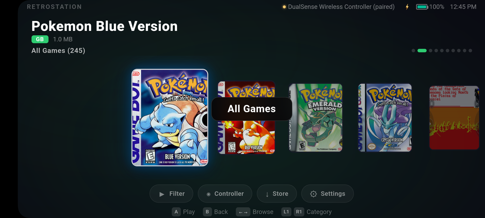
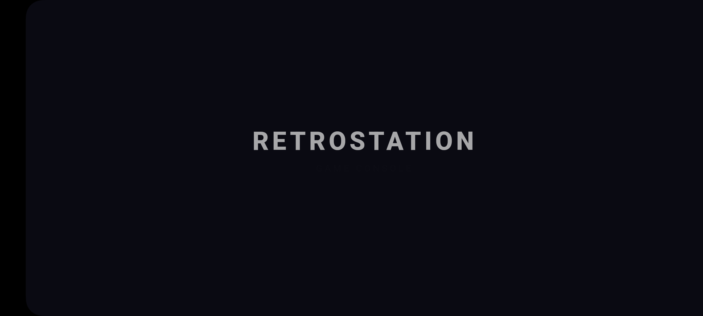
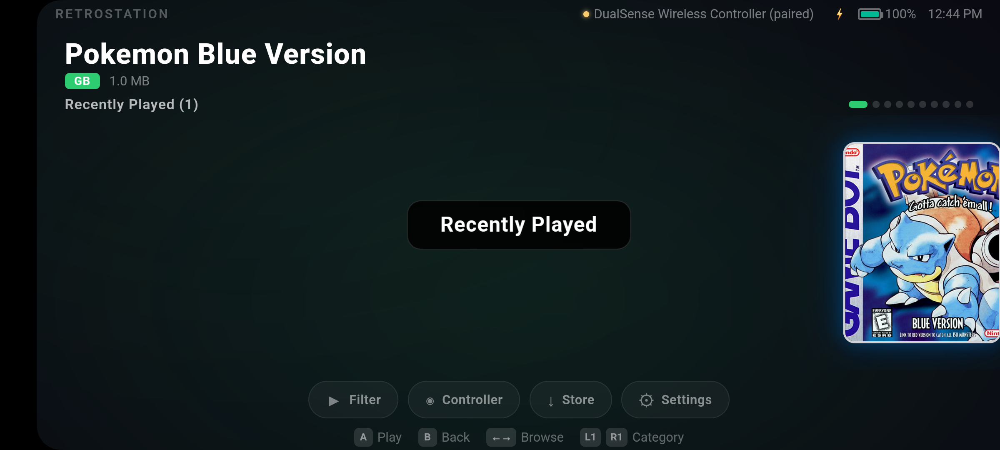
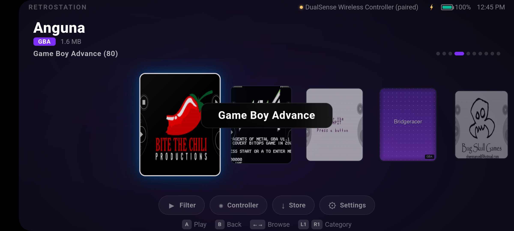
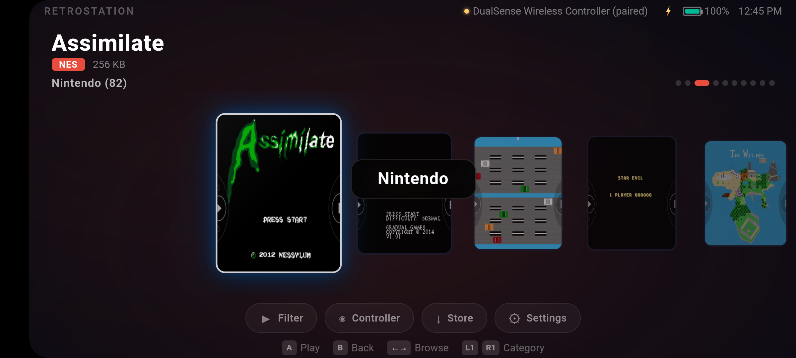
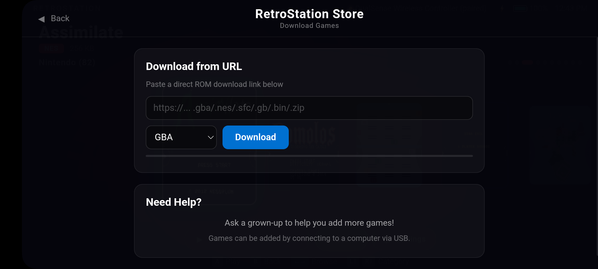

<p align="center">
  
</p>

<h1 align="center">RetroStation</h1>

<p align="center">
  <strong>A PS5-inspired home screen launcher for Android retro gaming handhelds</strong>
</p>

<p align="center">
  <a href="#-features">Features</a> •
  <a href="#-screenshots">Screenshots</a> •
  <a href="#-supported-systems">Systems</a> •
  <a href="#%EF%B8%8F-architecture">Architecture</a> •
  <a href="#-building">Building</a> •
  <a href="#-license">License</a>
</p>

<p align="center">
  
  
  
  
</p>

---

<p align="center">
  
</p>

RetroStation turns any Android-based retro handheld into a polished gaming console. It replaces the stock home screen with a sleek, controller-first UI — complete with cover art, sound effects, category browsing, and one-button game launch through **RetroArch** or **Lemuroid**.

Built as a single Android Activity with **zero Gradle** — the entire app compiles from raw `javac` → `d8` → `apksigner` in seconds.

## ✨ Features

🎮 **PS5-Style Interface** — Horizontal card carousel with smooth CSS animations, glow effects, and category-colored gradients

🖼️ **Auto-Generated Cover Art** — Python script creates stylized, system-themed covers for every ROM on device (or bring your own art)

🔊 **Spatial Sound Effects** — Web Audio API synthesized navigation sounds: ticks, selects, category switches, and back tones

📂 **Smart Categories** — Games organized by system with L1/R1 shoulder button switching, plus "All Games" and "Recently Played" views

🕹️ **Controller Status Bar** — Live DualSense/gamepad detection with connection status, battery level, and charging indicator

⚡ **Instant Launch** — One button press to launch any game via RetroArch (with correct core auto-selected) or Lemuroid deep linking

🏪 **Built-in Store** — Kid-friendly ROM download page for adding games directly on the device

🚀 **Boot Animation** — Cinematic PS5-style splash screen with staggered text reveal on every launch

📱 **Home Screen Replacement** — Registers as the default Android launcher — press Home to return to RetroStation

## 📸 Screenshots

<table>
  <tr>
    <td align="center"><br /><sub>Boot splash screen</sub></td>
    <td align="center"><br /><sub>Recently Played</sub></td>
  </tr>
  <tr>
    <td align="center"><br /><sub>All Games (245 titles)</sub></td>
    <td align="center"><br /><sub>Game Boy Advance</sub></td>
  </tr>
  <tr>
    <td align="center"><br /><sub>Nintendo (NES + SNES)</sub></td>
    <td align="center"><br /><sub>RetroStation Store</sub></td>
  </tr>
</table>

## 🎮 Supported Systems

| System | Core | Extensions |
|--------|------|------------|
| Game Boy | `gambatte` | `.gb` |
| Game Boy Color | `gambatte` | `.gbc` |
| Game Boy Advance | `mGBA` | `.gba` |
| NES | `FCEUmm` | `.nes` |
| SNES | `Snes9x` | `.sfc` `.smc` |
| Sega Genesis | `Genesis Plus GX` | `.bin` `.md` `.gen` |
| PlayStation 1 | `PCSX ReARMed` | `.iso` `.cso` `.pbp` `.chd` `.cue` |
| Nintendo 64 | `Mupen64Plus` | `.n64` `.z64` `.v64` |
| PSP | `PPSSPP` | `.iso` `.cso` |
| Dreamcast | `Flycast` | `.cdi` `.gdi` `.chd` |
| Doom | `PrBoom` | `.wad` |
| Arcade | `FinalBurn Neo` | `.zip` |

ROMs are loaded from `/sdcard/RetroHandheld/roms/<System>/` on the device.

## 🏗️ Architecture

RetroStation is intentionally minimal — **4 Java files, no dependencies, no Gradle.**

```
┌─────────────────────────────────────────────────┐
│                  Android Host                    │
│                                                  │
│  MainActivity.java                               │
│  ┌─────────────────────────────────────────────┐ │
│  │              WebView (fullscreen)           │ │
│  │                                             │ │
│  │  LauncherHTML.java → PS5-style UI           │ │
│  │  ┌──────────┐  ┌───────────┐  ┌──────────┐ │ │
│  │  │ CSS Grid │  │ JS Engine │  │Web Audio │ │ │
│  │  │& Animate │  │ Navigate  │  │  Sounds  │ │ │
│  │  └──────────┘  └─────┬─────┘  └──────────┘ │ │
│  │                      │                      │ │
│  └──────────────────────┼──────────────────────┘ │
│                         │ @JavascriptInterface    │
│  ┌──────────────────────┴──────────────────────┐ │
│  │            ConsoleBridge.java                │ │
│  │                                             │ │
│  │  • ROM scanning    • Game launching          │ │
│  │  • Controller info • Battery status          │ │
│  │  • Recent games    • File downloads          │ │
│  └─────────────────────────────────────────────┘ │
│                         │                        │
│  ┌──────────────────────┴──────────────────────┐ │
│  │  CoreMap.java — System → RetroArch core     │ │
│  └─────────────────────────────────────────────┘ │
└─────────────────────────────────────────────────┘
                          │
                    ┌─────┴─────┐
                    │ RetroArch │
                    │ / Lemuroid│
                    └───────────┘
```

**Why WebView?** The UI is 100% HTML/CSS/JS rendered inside a fullscreen WebView. This makes the interface trivially hackable — edit the HTML, rebuild in 5 seconds, test instantly. The Java layer only handles what the browser can't: file system access, game launching, and hardware queries.

**Why no Gradle?** The app has a single Activity and zero library dependencies. The entire build is `aapt2` → `javac` → `d8` → `zipalign` → `apksigner`. It compiles in ~3 seconds.

## 🔨 Building

### Prerequisites

- **Android SDK** with `build-tools/36.1.0` and `platforms/android-34`
- **Java 17+** (JDK)
- A debug keystore (one is included, or generate your own)

### Build & Install

```bash
# Build the APK
./build.sh

# Build and install to connected device
./build.sh install
```

That's it. No Gradle sync, no Android Studio, no waiting. The full build takes ~3 seconds.

### Cover Art Generation

The included Python script generates stylized cover art for all ROMs on a connected device:

```bash
pip install Pillow
python generate_covers.py
```

Then push the covers to the device:

```bash
adb push covers/ /sdcard/RetroHandheld/covers/
```

### Device Setup

1. Create the ROM directory structure on your device:
   ```
   /sdcard/RetroHandheld/
   ├── roms/
   │   ├── GB/
   │   ├── GBC/
   │   ├── GBA/
   │   ├── NES/
   │   ├── SNES/
   │   ├── Genesis/
   │   ├── PS1/
   │   ├── N64/
   │   ├── PSP/
   │   ├── Dreamcast/
   │   ├── Doom/
   │   └── Arcade/
   └── covers/          ← generated cover art goes here
   ```

2. Install [RetroArch](https://www.retroarch.com/) with the required cores (see table above)
3. Install RetroStation: `./build.sh install`
4. Set RetroStation as your default home launcher

## 📁 Project Structure

```
launcher-app/
├── AndroidManifest.xml          # App manifest — launcher intent, permissions
├── build.sh                     # Full build script (no Gradle!)
├── generate_covers.py           # Procedural cover art generator
├── src/com/retrohandheld/launcher/
│   ├── MainActivity.java        # Single Activity — WebView + input dispatch
│   ├── ConsoleBridge.java       # Java↔JS bridge — ROMs, launch, hardware
│   ├── CoreMap.java             # System → RetroArch core mapping
│   └── LauncherHTML.java        # Complete PS5-style UI (HTML/CSS/JS)
├── res/
│   ├── mipmap-xxxhdpi/          # App icon
│   └── values/strings.xml       # App name
├── covers/                      # Generated cover art (247 images)
└── screenshots/                 # Device screenshots for docs
```

## 🎯 Controller Mapping

Designed for handheld gaming devices with built-in controls:

| Button | Action |
|--------|--------|
| D-Pad | Navigate games & menus |
| A / Cross | Select / Launch game |
| B / Circle | Go back |
| L1 | Previous category |
| R1 | Next category |
| Start | Open menu |
| Y / Triangle | Show game info |

## 🤝 Contributing

Contributions are welcome! This project is intentionally simple and hackable. See [CONTRIBUTING.md](CONTRIBUTING.md) for guidelines.

## 📄 License

[MIT](LICENSE) — do whatever you want with it.

---

<p align="center">
  Built with ❤️ for the retro gaming community
</p>
